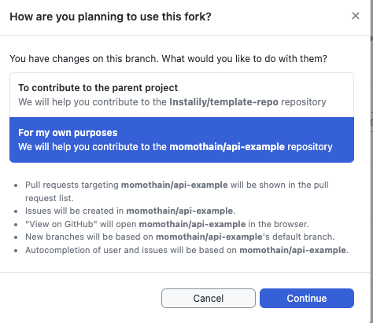
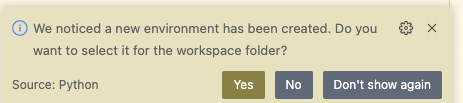

# template-repo

Fork and get started in your own repo!

With Docker, Datadog, Logger deployment setup

## Fork


## Runtime Environment Compilation

> Global local Private IL repo read PAT
> ! Needs to be set in each deployment env

```bash
open ~/.zshrc
open ~/.bashrc

# configs
export GITHUB_TOKEN=
```

### Local NON-DOCKER -- for debugging docker build/run

#### run

```bash
fastapi dev src/app.py
ddtrace-run fastapi dev src/app.py

gunicorn --bind 0.0.0.0:8080 --workers 3 --worker-class uvicorn.workers.UvicornWorker --threads 4 --timeout 120 src.app:app
ddtrace-run gunicorn --bind 0.0.0.0:8080 --workers 3 --worker-class uvicorn.workers.UvicornWorker --threads 4 --timeout 120 src.app:app
```


#### setup

Copy and paste all these into terminal (the #comments wont break anything)

```shell
# update
brew upgrade python
# venv
python -m venv .venv #.venv is the name
source .venv/bin/activate
```

> Select venv with your IDE too


```bash
# instalily package
pip install --upgrade pip
pip install git+https://github.com/instalily/instalily-platform #auth required
```

---

### Docker

#### Setup

- [] TODO: Set vars from TEMPLATE.env in runtime (local .env or GCP deployment) environment
- [] Configure Dockerfile
  - ENV
  - run CMD
  - EXPOSE $PORT (see (#GCP Deployment))
- Datadog API Key into .env, GPC Secrets
- Instalily PAT into .env, secrets

#### Run

> setup/build the project environment 'recipe' through an image, 
> then instantiate the 'service' or 'executable' it through a container

```bash
docker build -t <service>-image .
docker rm --force <service>-container
docker run --name <service>-container -p 8080:8080 <service>-image

docker build -t template-image .
# DOCKER_BUILDKIT=1 docker build --secret id=github_token,env=GITHUB_TOKEN -t template-image .

docker build --build-arg GITHUB_TOKEN=$GITHUB_TOKEN --build-arg DD_API_KEY=$DD_API_KEY --build-arg PORT=$PORT -t template-image .
docker rm --force template-container
docker run --name template-container -p 8080:8080 template-image
```

```bash
# build/compile an "image" of your project's code executable, using its Dockerfile
docker build -t <service>-image .
# run an instance of the project's image in a new "container" or runtime-environment, also using the Dockerfile
# -d -> bg (background process) and print container ID
# -p <host-port*:container-port>  -> Maps port 8080 of the host to port 8080 of the container
    # *host by default is all your PC's network aka 0.0.0.0 and all your IPs public, LAN, ..
    # specify localhost:8080 if needed
# --name lol, otherwise they are rand gen
# last arg 
docker run -d --name <service>-container -p 127.0.0.1:8080:8080 <service>-image

# list all containers on your pc
docker ps
```

#### cmds for a container

```bash
# get all stdout, stderr output
docker logs <service>-container

# re-build/run
docker build ...
docker stop <service>-container
docker rm <service>-container
docker rm --force <service>-container
docker run ...

# run a command inside the container as a separate process
docker exec -it <NAME/CONTAINER_ID> sh
```

## Deployment – Google Cloud Run

### Create Service

- [] https://console.cloud.google.com/run?project=parstown-412016
- Create new deployment: `Connect Repository` at the top
- `GitHub`

### GitHub CD Build Configurations

- Select your repo, branch
- `Build type` -> Dockerfile
- Save

### Service Configs

- name
- Region -- my default is us-central1 (Iowa) b/c Low CO2 and geo proximity
- auth = allowed unauthenticated*
- min instance = 0 for dev, 1 for prod

### Env configs

#### Services' Listening Port (Conventions)

- 3000 for UIs
- 8080 for APIs, 8080 alt/testing
- 5000 for Flask APIs

#### Variables and Secrets (sensitive and deployment-specific env vars)

- see TEMPLATE.env
- API keys and other sensitive data should be stored in the [Secret Manager](https://console.cloud.google.com/security/secret-manager?project=parstown-412016) and refernced

---

# Development

## logger

example use

```python
from instalily.logging import logger

logger.debug("asdfasd")
logger.info("asdfasd")
```

---


# TODO

## OhMyZSH

## GitHub creds on mac
